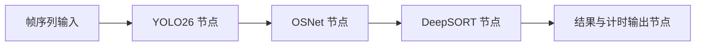

# nndeploy 感知流水线接入设计

日期：2026-10-06。

状态：用户已确认采用开源框架底座及最小接入方向；本文件是待审阅的书面设计。nndeploy 尚未下载、编译或接入本项目。

## 1. 目标与交付边界

以 nndeploy 的 C++ 图执行核心为底座，将已有 YOLO26 → OSNet → DeepSORT 链路改为节点流水线，在当前 Windows 设备验证串行与流水线执行。获得可继续研究调度、数据所有权、资源生命周期与端侧性能的工程基础。

第一阶段交付：

- 固定版本的 nndeploy 最小 C++ 核心及可复现构建入口。
- 一个使用真实 nndeploy Graph、Node、Edge 和执行器的新 C++ 程序 `perception_pipeline`。
- CPU、DirectML 两种已有推理路径，以及串行、流水线两种执行模式。
- 已有 180 帧样例的逐帧回归报告，以及顺序、背压、空检测、结束和取消验证。
- VS Code 构建、运行和调试入口；Python 工具继续使用 Anaconda 的 `jetson-perception` 环境。

本阶段处理现有 PNG 帧序列，复用已验证的模型、预处理及跟踪算法。实时视频采集、真实时间间隔预测、ReID 动态批量、CUDA 预处理和 Jetson TensorRT 属于后续阶段，各自建立对照后推进。第一阶段不据此声称实时摄像头 FPS 或 Jetson 性能。

## 2. 已核对的环境与版本

| 项目 | 接入依据 |
| --- | --- |
| 项目目录 | `H:/刘欣阳资料/code/jetson-perception-cpp` |
| 当前系统与 GPU | Windows / RTX 4080，已有原生 ORT CPU、DirectML 验证结果 |
| C++ 工具链 | 项目内 LLVM-MinGW，clang 23.1.2，x86_64 Windows GNU，C++17 |
| Python 与构建工具 | Anaconda `jetson-perception`；CMake、Ninja 来自该环境 |
| MSVC | 2026-10-06 的本机检查未发现 Visual Studio 安装定位工具或 `cl` 命令 |
| nndeploy 上游版本 | `1c9e2d508bf82fd8ee47656897906d133ebf7f3d`，Apache-2.0 |
| 现有算法检查 | 运行现有 `build/tracker_tests.exe`，六组算法检查通过；不是 nndeploy 验证 |
| 版本管理 | 当前项目不是 Git 仓库；设计文件保存到项目内，未创建提交 |

nndeploy 上游 Windows CI 使用 Visual Studio 2022，其 ORT 配置路径中可见 CUDA provider 设置，未见 DirectML provider 设置。这两项是实际接入差异，不能将上游平台支持等同于本机兼容性已经通过。

## 3. 依赖与构建决策

1. 固定上述提交，保留上游 LICENSE 与来源记录。获取源码时只初始化最小核心实际需要的依赖，并记录下载内容与本地补丁。
2. 以 `cmake/config_minimal.cmake` 为起点，启用基础模块、线程池、CPU 设备和 DAG；关闭 Python 绑定、演示程序、GUI、OpenCV 插件、其他模型插件及 GPU 设备后端。通用推理接口若被核心引用则保留，但第一阶段不启用上游 ORT/TensorRT 实现。
3. 由独立配置保存本项目的构建选择，优先验证现有 LLVM-MinGW。新程序与框架采用同一 C++ 工具链，禁止混用 MinGW 与 MSVC 的 C++ 二进制接口。
4. 如仅有编译选项或 Windows 条件分支差异，可维护小范围兼容补丁；如涉及不可合理控制的工具链兼容问题，则采用 MSVC Build Tools 统一编译新目标，IDE 仍使用 VS Code。切换前记录具体失败与原因。
5. 新建独立框架构建目录和应用目标，避免复用旧构建目录中的编译器缓存。原有算法验证入口继续用于对照。

## 4. 节点与数据流

输入由应用控制器读取帧序列并提交到图的输入边。框架管理图内节点执行、数据传递与生命周期，业务层不得自行按顺序直接调用全部节点来替代 Graph 执行。

| 组件 | 职责 | 持久状态 |
| --- | --- | --- |
| 应用控制器 | 参数检查、初始化、输入提交、结束与错误协调 | Runtime、Ort::Env、Graph、运行状态 |
| YOLO26 节点 | Letterbox、模型调用、输出解析、person 过滤 | 检测模型实例及独占工作缓冲区 |
| OSNet 节点 | 按检测顺序裁剪、模型调用、L2 归一化 | ReID 模型实例及独占工作缓冲区 |
| DeepSORT 节点 | 按帧顺序推进已有跟踪器，生成结果快照 | 当前单路视频的 Tracker |
| 输出节点 | 写 JSONL、MOT、特征缓存及计时结果 | 文件句柄及统计汇总 |

模型实例在节点初始化时建立并暖机，逐帧调用阶段复用实例。第一阶段将现有 `NativeModel` 封装到自定义节点中，以保留已验证的 ORT/DirectML 行为；这是接入过渡层。后续统一到 nndeploy Inference/Tensor 接口时，另行对照设备内存、输出绑定与数值结果。

## 5. 数据契约与所有权

每个阶段输出完整帧消息，消息包含 `stream_id`、单调递增的 `frame_id`、源时间戳、进入程序的单调时钟时间和阶段统计。第一阶段仅接入一条视频，`stream_id=0`；源时间戳沿用帧序号与输入 FPS 计算，跟踪预测仍使用已有的一帧步长。进入程序的时间在开始读取该 PNG 文件前采样，端到端计时结束于输出节点完成该帧序列化；这样包含读取、解码、队列等待和日志输出。

- `FramePacket`：原始 RGB 图像及宽高。采用有所有者的不可变共享图像；消息不引用读取函数的临时变量。
- `DetectionPacket`：帧身份、图像所有者、原图坐标下的检测框、类别和置信度。Letterbox 变换由检测节点内部完成还原。
- `ObservationPacket`：帧身份、检测顺序、TLWH 框、置信度和归一化特征。特征通过检测索引对应检测框。
- `TrackPacket`：帧身份、必要的图像所有者、观测、独立的轨迹快照和阶段统计。

轨迹快照仅包含输出与验证需要的数据：ID、框、置信度、状态、观测标志、检测索引、hits、age、time_since_update、gallery_size 和 valid_box。输出边不得直接持有 `Tracker::step()` 返回的内部容器引用，也不复制整个历史特征库或暴露可修改 Kalman 状态。

零目标帧必须输出带相同帧身份的空观测消息，并执行一次跟踪更新；不能通过“不写输出边”表示空检测，否则会造成下游丢帧或等待。

## 6. 执行、背压与顺序约束

- 串行模式首先作为迁移回归入口；流水线模式采用框架流水线执行器。
- 每个模型实例只有一个调用者，同时只有一个任务使用其输入、输出及工作缓冲区。第一阶段不对同一模型实例发起重叠 Run。
- 同一 stream 的跟踪器由一个节点按帧身份顺序更新。入口与各节点检查帧号单调性，出现重复或倒序时明确报错。
- 图内阶段之间可处理不同帧，但输出中的图像、检测、特征和轨迹必须属于同一帧。
- 第一阶段所有流水线边显式配置有界容量，默认 4，使用阻塞背压，不丢帧。容量必须大于零，记录队列峰值与等待时间。
- 新程序提供串行/流水线与队列容量配置。运行记录保存实际模型路径、参数、执行模式、框架版本、后端、输入 FPS 与计时边界。

后续实时模式的 DropOldest 只在定义清楚的输入入口应用，并与真实时间间隔预测一起验证；不能把中间阶段任意丢帧当作现有 DeepSORT 的无行为变化优化。

## 7. 生命周期与异常

应用拥有 Runtime 与 Ort::Env，生命周期覆盖所有模型节点。图初始化失败时释放已经初始化的节点；图执行期间捕获节点错误并向应用传递，不能将推理失败伪装为有效空检测。

- 正常结束：停止提交输入，等待已提交的最后一帧输出，确认帧数后再停止图、关闭文件和释放模型资源。
- 用户取消：停止输入，终止所有阻塞等待，允许结束当前不可抢占的模型调用，退出工作线程；结果报告标记取消及已完成帧数。
- 节点失败：保留首个错误及对应帧身份，停止提交，唤醒等待者并返回非零退出码。
- 输出失败：与模型失败一样传播，不能无限积压待写消息。

上游源码审查发现：`PipelineEdge::requestTerminate()` 设置终止标志并通知消费者条件变量；容量等待使用另一个 `queue_cv_`，其等待谓词未包含终止标志。因此“满队列时取消”属于必须实测的接入风险，不能仅凭接口名称判断可以正确退出。如果验证出现挂起，以最小兼容补丁修复终止通知、等待谓词及终止后的消息所有权，并保存复现测试和补丁依据。

另外，现有 `native.hpp` 将 STB implementation 宏及非 inline 定义放在头文件中。迁移到多个源文件时，将这些实现移入单独的 `.cpp`，头文件保留声明，防止重复定义；通过原有数值对照验证提取过程。

## 8. 验证与验收

### 8.1 最小框架验证

固定版本核心编译成功后，通过小规模带帧身份的节点测试验证串行、流水线、有界背压、初始化失败和结束。测试必须通过真实 Graph/Edge 执行，不以直接调用业务函数替代。

### 8.2 感知迁移回归

分别对 CPU、DirectML 运行原程序与新程序，使用相同的 180 帧、模型、阈值、线程配置及跟踪参数。比较同一后端的旧串行、新串行、新流水线：

- 原图尺寸、帧身份、检测顺序与预处理张量一致。
- 检测框误差小于 0.01 px，置信度误差小于 1e-4，特征余弦相似度大于 0.99999，所有结果有限且特征归一化。
- 轨迹 ID、状态、匹配检测索引、观测标志、hits、age、time_since_update 和 gallery_size 逐帧一致。此处直接对照两个 C++ 版本，不能重新映射 ID 掩盖关联差异。
- 继续执行既有算法与作者实现对照；迁移数值门限不能取代既有 Kalman 数值检查。
- 检测和 ReID 的运行 profile 能确认 DirectML 实际执行，不能以启动参数为证据。

### 8.3 流水线与故障验证

采用受控序列或测试节点验证：空观测、多帧在途、慢输出导致队列饱和、正常结束尾帧、重复/倒序帧、节点失败、满队列取消及重复启动。要求消息帧身份一致、队列不超配置上限、线程完成退出、已完成结果可解析且失败返回非零退出码。

队列取消测试使用外部测试超时，避免测试进程永久挂起。受控测试在请求取消后 5 秒内退出；真实推理仅承诺当前 Run 返回后可以完成退出，不宣称能够抢占正在执行的模型调用。

### 8.4 性能证据

输出每帧节点服务时间、队列等待时间和进入程序至结果消费的端到端时间，汇总吞吐与 P50/P95；将初始化、暖机和稳态测量分开。串行节点耗时之和不能作为流水线吞吐，纯感知耗时也不能作为包含 IO 的端到端指标。

第一阶段验收依据正确性、可复现构建、明确所有权、有界资源与可退出性，不预设加速百分比。GPU 裁剪、动态批量及 TensorRT 的收益在各自后续对照中测量。

## 9. 验证后的演进顺序

1. 第一阶段通过后，锁定框架版本与局部补丁，完成代码调用链说明。
2. 接入原生视频输入并定义时间戳与断流语义，然后加入实时输入策略及真实时间间隔预测。
3. 接入批量 ReID，验证检测索引、尾批和批等待期限，比较身份指标与延迟。
4. 接入统一 Inference 接口、CUDA 预处理与 TensorRT；在实际 Jetson 型号和 JetPack 版本上建立独立部署配置与测量。

## 10. 参考证据

- [nndeploy 固定源码版本](https://github.com/nndeploy/nndeploy/tree/1c9e2d508bf82fd8ee47656897906d133ebf7f3d)
- [最小构建配置](https://github.com/nndeploy/nndeploy/blob/1c9e2d508bf82fd8ee47656897906d133ebf7f3d/cmake/config_minimal.cmake)
- [图节点与生命周期接口](https://github.com/nndeploy/nndeploy/blob/1c9e2d508bf82fd8ee47656897906d133ebf7f3d/framework/include/nndeploy/dag/node.h)
- [流水线边、队列与终止逻辑](https://github.com/nndeploy/nndeploy/blob/1c9e2d508bf82fd8ee47656897906d133ebf7f3d/framework/source/nndeploy/dag/edge/pipeline_edge.cc)
- [流水线执行器](https://github.com/nndeploy/nndeploy/blob/1c9e2d508bf82fd8ee47656897906d133ebf7f3d/framework/source/nndeploy/dag/executor/parallel_pipeline_executor.cc)
- [上游 ORT provider 配置](https://github.com/nndeploy/nndeploy/blob/1c9e2d508bf82fd8ee47656897906d133ebf7f3d/framework/source/nndeploy/inference/onnxruntime/onnxruntime_convert.cc)
- [上游 Windows 构建入口](https://github.com/nndeploy/nndeploy/blob/1c9e2d508bf82fd8ee47656897906d133ebf7f3d/.github/workflows/windows.yml)
- 当前项目事实：`src/native.hpp`、`src/inference.hpp`、`src/deepsort.*`、`src/track_main.cpp`、`tools/validate_tracking.py`、`reports/tracking-validation.md`。
