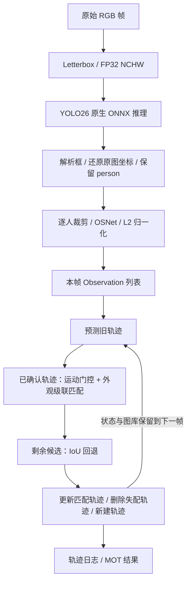

# 第 1 课：从 YOLO26 推理到 DeepSORT 轨迹输出

状态：已展开。范围：当前本地 C++ 实现的初始化、单帧观测构建、跨帧关联、轨迹管理与输出。不包含模型训练、TensorRT 或新的算法改动。

## 场景与目标

输入一段连续视频的 PNG 帧序列，理解一个行人检测框如何获得跨帧稳定的轨迹 ID。需要区分三个对象：`Detection` 是当前帧的检测结果，`Observation` 是附带外观特征的当前帧观测，`Track` 是跨帧保留的轨迹。

以下文件链接均指向本次分析的本地源码。附录记录源码 SHA-256，行号对应这一快照。

## 主链与阅读顺序



图中从 J 返回 G 表示下一帧对同一个 `Tracker` 再调用 `step()`；本帧只有一次 `step()`。实际顺序是先提取完整帧的检测与外观观测，再进入 `step()` 预测旧轨迹。

| 顺序 | 源码入口 | 阅读目的 |
|---|---|---|
| 1 | [src/track_main.cpp:142](H:/刘欣阳资料/code/jetson-perception-cpp/src/track_main.cpp:142) 的帧循环 | 看清模块怎样串起来 |
| 2 | [src/inference.hpp:70](H:/刘欣阳资料/code/jetson-perception-cpp/src/inference.hpp:70) 的 `NativeModel::run()` | 看清两次模型推理的调用边界 |
| 3 | [src/native.hpp:183](H:/刘欣阳资料/code/jetson-perception-cpp/src/native.hpp:183) 的 `decode()` | 看清检测框坐标和筛选 |
| 4 | [src/inference.hpp:86](H:/刘欣阳资料/code/jetson-perception-cpp/src/inference.hpp:86) 的 `reid_crop()` | 看清外观模型的输入 |
| 5 | [src/deepsort.cpp:186](H:/刘欣阳资料/code/jetson-perception-cpp/src/deepsort.cpp:186) 的 `Tracker::step()` | 看清关联和状态变化 |
| 6 | [src/deepsort.cpp:173](H:/刘欣阳资料/code/jetson-perception-cpp/src/deepsort.cpp:173) 的 `observe()` | 看清匹配成功后的更新 |

匈牙利算法内部的势变量和增广路径可以第二遍再读；第一遍先理解输入代价矩阵、返回配对以及门限拒绝。

## 1. 初始化只执行一次，轨迹状态在帧循环之外

Windows 入口是 [track_main.cpp:319](H:/刘欣阳资料/code/jetson-perception-cpp/src/track_main.cpp:319) 的 `wmain()`，转换参数后调用 `track(args)`。

`track()` 在帧循环之前完成以下工作：

- 创建 `deepsort::Tracker tracker(o.config)`，见 [track_main.cpp:82](H:/刘欣阳资料/code/jetson-perception-cpp/src/track_main.cpp:82)。所有帧共享这个实例；它持有 `tracks_`、下一条 ID 和配置。
- 枚举并排序 PNG 帧。
- 创建原生 ONNX Runtime 环境，以及分别加载 YOLO26 和 OSNet 的两个 `NativeModel`。
- 校验输入输出形状，预热两个模型。预热不调用 `tracker.step()`，因此不会创建轨迹。

`NativeModel` 在构造时分配固定尺寸的 `input/output` 向量，再用 `Ort::Value::CreateTensor` 包装它们。`run()` 调用 `session.Run()`，把结果写入已经分配的输出缓冲区。下一帧复用同一个 session 和缓冲区。

模型 session、缓冲区、`Tracker` 都跨帧存在；`people` 和 `observations` 是每帧新建的临时列表。若把 `Tracker` 放进帧循环，每帧都会丢失历史并重新分配 ID。

## 2. YOLO26：图片变张量，输出仍然没有轨迹 ID

帧循环中的主调用是：

```cpp
const auto transform = letterbox(image, int(shape[2]), detector.input);
detector.run();
const auto all = decode(detector.output.data(),
                        size_t(detector.output_shape[1]),
                        o.threshold, transform, image, 80);
```

`load_image()` 输出 RGB 字节数组。`letterbox()` 等比例缩放、填充 114，转换为 `/255` 的 FP32 NCHW 张量，同时返回缩放比例和填充位置。当前参考模型输入为 `[1,3,640,640]`。

`detector.run()` 进入 [inference.hpp:70](H:/刘欣阳资料/code/jetson-perception-cpp/src/inference.hpp:70) 的公共推理接口。当前 YOLO26 输出 `[1,300,6]`，每行含义是：

```text
[x1, y1, x2, y2, confidence, class_id]
```

这里的坐标属于模型输入画布，尚未恢复为原图坐标；300 是输出候选行数，不是本帧实际行人数。

## 3. 检测后处理：先还原坐标，再从原图裁剪行人

`decode()` 在 [native.hpp:183](H:/刘欣阳资料/code/jetson-perception-cpp/src/native.hpp:183) 中依次执行：

1. 检查输出是否有限，过滤低于 `threshold` 的候选，默认 0.25。
2. 校验类别编号。
3. 去掉 Letterbox 填充，再除以缩放比例：`x=(model_x-left)/scale`、`y=(model_y-top)/scale`。
4. 将坐标限制在原图边界，去掉没有正宽高的框。

当前导出是端到端的 `[1,N,6]`，此处没有再做一次 NMS。

随后 [track_main.cpp:155](H:/刘欣阳资料/code/jetson-perception-cpp/src/track_main.cpp:155) 只把 `class_id==0` 放入 `people`。80 类和 person=0 是当前 COCO 参考模型的约定；换自训类别时需要同步核对这个约定。

到这里得到的是：`Detection{原图 x1,y1,x2,y2, confidence, class_id}`。它只能描述当前帧里的对象，还没有身份编号。

## 4. ReID：一个检测框对应一条 512 维外观特征

[track_main.cpp:164](H:/刘欣阳资料/code/jetson-perception-cpp/src/track_main.cpp:164) 对 `people` 中每个行人执行：

```cpp
reid_crop(image, detection, reid.input);
reid.run();
auto embedding = normalized_embedding(reid.output);
```

`reid_crop()` 使用恢复后的框在原始 RGB 图像上裁剪，左上角取 floor、右下角取 ceil，限制到图像边界，再双线性缩放为宽 128、高 256。

逐通道做 `(pixel/255 - mean)/std`，均值为 `[0.485,0.456,0.406]`，标准差为 `[0.229,0.224,0.225]`。最终张量为 `[1,3,256,128]`。

OSNet 通过同一个 `NativeModel::run()` 接口得到 `[1,512]`。`normalized_embedding()` 计算 `f/||f||`，使特征成为单位向量，后续外观距离就可以用 `1-dot(f,g)` 计算。非有限输出或零特征会抛出异常。

当前每个行人单独推理，batch=1。裁剪、归一化、L2 归一化都在 CPU 上；启用 DirectML 主要改变模型执行后端。输入输出 `Ort::Value` 使用 CPU 内存包装，因此当前代码不能描述为全 GPU 预处理或零拷贝链路。

## 5. Observation 是检测器与跟踪器之间的接口

[track_main.cpp:175](H:/刘欣阳资料/code/jetson-perception-cpp/src/track_main.cpp:175) 把上述结果组装为：

```cpp
observations.push_back({
    {detection.x1, detection.y1,
     detection.x2 - detection.x1,
     detection.y2 - detection.y1},
    detection.confidence,
    std::move(embedding)
});
```

其结构定义在 [deepsort.hpp:13](H:/刘欣阳资料/code/jetson-perception-cpp/src/deepsort.hpp:13)：

| 字段 | 含义 | 后续用途 |
|---|---|---|
| `box` | 原图 TLWH：左上角 x/y、宽/高 | Kalman 观测、运动门控、IoU |
| `confidence` | 检测置信度 | 校验、保存、输出；当前不参与关联代价 |
| `feature` | L2 归一化外观向量 | 与轨迹特征图库计算余弦距离 |

`Observation` 不带轨迹 ID，也不保存类别和时间戳。类别已经在外层筛选；时间戳只写入日志。跟踪核心因此可以独立处理检测与外观观测。

## 6. step() 第一阶段：验证观测，再预测所有旧轨迹

外层在 [track_main.cpp:186](H:/刘欣阳资料/code/jetson-perception-cpp/src/track_main.cpp:186) 调用：

```cpp
const auto &tracks = tracker.step(observations);
```

`step()` 先检查框、置信度、特征维度、有限值和单位范数，再修改轨迹状态。

随后 [deepsort.cpp:209](H:/刘欣阳资料/code/jetson-perception-cpp/src/deepsort.cpp:209) 对旧轨迹调用 `kf_.predict()`，并执行 `age++`、`time_since_update++`、`detection_index=-1`。

TLWH 在 `xyah()` 中转换为：

```text
z = [cx, cy, a, h]
cx=x+w/2，cy=y+h/2，a=w/h
```

轨迹 `mean` 则包含 8 维：`[cx,cy,a,h,vx,vy,va,vh]`，`covariance` 为 8×8。预测使用恒速度模型，将位置推进一个处理帧，并传播不确定性。

实际 `dt=1` 写在运动矩阵中。外层 `timestamp_s=index/fps` 不传入 `step()`，当前没有按真实时间间隔改变运动模型。

## 7. step() 第二阶段：已确认轨迹做外观级联匹配

[deepsort.cpp:245](H:/刘欣阳资料/code/jetson-perception-cpp/src/deepsort.cpp:245) 从 `time_since_update=1` 开始，逐层处理已确认轨迹。刚被观察过的轨迹先争取本帧剩余检测，更久未更新的轨迹随后处理。

在局部 `match(rows,true)` 中，代价矩阵的行是本级轨迹，列是仍未匹配的观测。每一对候选先做运动门控：

```text
d_motion² = (z - H·mean)ᵀ · S⁻¹ · (z - H·mean)
```

实现用 Cholesky 三角求解，避免直接求逆。大于代码门限 9.4877 时，该候选代价设为 1e5。通过门控时才使用外观代价：

```text
cost(track, detection) = min_g [1 - dot(g, detection.feature)]
                         g 属于该轨迹 gallery
```

图库保留多次观测得到的特征，比较时取最小距离；默认最多 100 条。当前没有按检测分数、遮挡或模糊质量决定是否入库。

`assign()` 对该级代价矩阵进行匈牙利分配，再拒绝超过 `max_cosine_distance` 的配对，默认 0.2。它在本级求一对一分配；整个级联按轨迹新旧顺序执行，不能表述为对所有轨迹一次性求解。

匹配成功后立即调用 `observe()`，设置匹配标记，因此该轨迹和检测不会再被后面的级联层或 IoU 阶段重复使用。

## 8. step() 第三阶段：IoU 回退有明确候选范围

[deepsort.cpp:255](H:/刘欣阳资料/code/jetson-perception-cpp/src/deepsort.cpp:255) 只选两类尚未匹配的轨迹：

- `Tentative` 新轨迹。
- `time_since_update==1` 的已确认轨迹。

它们与剩余观测按 `1-IoU` 构建代价矩阵，再调用 `assign()`。默认 `max_iou_distance=0.7`，即允许的 IoU 不小于 0.3。

这一分支不计算外观距离，也没有调用 Mahalanobis 门控。故某对候选在外观阶段没有通过，并不意味着它一定无法在 IoU 回退中匹配。较久失配的已确认轨迹不进入这一分支。

新轨迹前两次续接默认依靠 IoU；第三次命中后变为 Confirmed，从下一帧开始有资格进入外观级联。

## 9. step() 第四阶段：更新、删除、新建，再返回持久轨迹列表

`observe()` 在 [deepsort.cpp:173](H:/刘欣阳资料/code/jetson-perception-cpp/src/deepsort.cpp:173) 中执行：Kalman 测量更新、`hits++`、失配计数归零、记录当前检测索引和置信度、特征入库，以及状态确认。

Kalman 更新融合的是预测状态和当前框测量，最终 `Track::box()` 从更新后的状态重建 TLWH，因此轨迹框可能与本帧检测框略有不同。

关联结束后，失配处理在 [deepsort.cpp:261](H:/刘欣阳资料/code/jetson-perception-cpp/src/deepsort.cpp:261)：Tentative 一次失配就删除；Confirmed 在 `time_since_update>max_age` 时删除。默认保留最多 30 个失配帧，第 31 帧删除。Deleted 轨迹通过 `erase()` 移出容器，不会出现在本帧返回列表中。

剩余未匹配检测在 [deepsort.cpp:271](H:/刘欣阳资料/code/jetson-perception-cpp/src/deepsort.cpp:271) 新建轨迹：`id=next_id_++`、零初始速度、初始化协方差、存第一条特征；默认状态 Tentative、hits=1。`n_init=1` 是此实现的特殊分支，会立即确认。

`step()` 返回 `tracks_` 的 const 引用，包含本帧观测到的轨迹和仍然保留的失配预测轨迹。外层马上消费这个引用；下次 `step()` 会继续修改同一容器，不能把它当作永久不变的上一帧快照。

## 10. 输出和可视化：有轨迹不等于当前画面一定有框

[track_main.cpp:230](H:/刘欣阳资料/code/jetson-perception-cpp/src/track_main.cpp:230) 把存活轨迹写入 `tracks.jsonl`。`observed` 来自 `time_since_update==0`；`detection_index` 是本帧 `observations/people` 列表里的下标，不是轨迹 ID。

只有 `Confirmed && observed && 正宽高` 的轨迹写入 MOT 结果。离线渲染器读取日志后，用同样的状态/观测条件和 `valid_box` 过滤显示。因而默认前两帧的新轨迹已经存在，但不会画出来；失配预测轨迹也保留在日志中而不绘制。

日志中的 `confidence` 是最近匹配检测的分数，不是跟踪器新算出的身份置信度。长期未更新的线性预测可能产生非正尺寸，源码保留该内部状态，输出时通过 `valid_box` 标记。

## 11. 用已保存的实际记录重走一次

以下来自 `output/tracking-dml/tracks.jsonl` 中轨迹 ID 1 的记录：

| 帧 | 本帧检测索引 | hits | 状态 | 代码发生的事 |
|---|---:|---:|---|---|
| 1 | 0 | 1 | Tentative | 无旧轨迹，未匹配观测创建 ID 1 |
| 2 | 0 | 2 | Tentative | 新轨迹走 IoU 回退，匹配后 observe |
| 3 | 2 | 3 | Confirmed | 再次经 IoU 匹配，达到确认次数 |
| 4 | 1 | 4 | Confirmed | 已有资格先走外观级联，失败时仍可能 IoU 回退 |

检测下标从 0 变为 2 再变为 1，而轨迹 ID 一直是 1。这说明 ID 维护不能依赖检测列表的排序。当前日志记录匹配下标，没有记录 `matched_by=appearance/iou`，所以单凭第 4 帧这条日志不能断言最终是哪一阶段匹配成功。

## 12. 重要分支、错误边界与当前改进落点

即使本帧没有行人，也必须调用 `step({})`：旧轨迹仍然要预测、累计失配并按条件删除。若外层遇到空检测直接跳过跟踪器，轨迹年龄和删除时机就会偏离处理帧。

当前模型形状错误、非有限输出、无效特征、图片读入失败或 Kalman 协方差求解失败会抛出异常，入口捕获后打印错误并返回 1。没有自动重试，也没有跳过坏帧后继续运行的恢复分支。

下面是基于源码结构和已有报告的分析，尚未实施：

- 感知算法：在特征入库前增加质量筛选，或者记录各匹配阶段与拒绝原因，便于解释 ID 切换。当前置信度不影响外观代价，也没有低分检测的第二阶段关联。
- 时间模型：将实际时间间隔传入 `step()` 并修改预测及过程噪声；仅保存时间戳不会自动获得变间隔运动模型。
- 端侧优化：`for (people)` 中逐人 ReID 调用，以及 CPU 裁剪/归一化，是明确的优化入口。已有桌面测量显示它们合计约 11.1 ms/帧，DeepSORT 关联约 0.147 ms/帧；这些是固定样例的历史测量，不是 Jetson 数据，也不代表改造后的收益。

## 完整流程回顾与复述任务

一帧原始 RGB 图片经过 YOLO26 得到候选框；还原原图坐标并筛选行人后，逐个裁剪送入 OSNet，得到归一化特征。每个框与特征组成本帧 Observation。跨帧共享的 Tracker 先预测旧状态，再做外观级联与 IoU 回退，更新、删除和创建轨迹，最后把 ID 及状态交回外层输出。

自行复述：同一个行人在第 1、2、3 帧被检测到，第 4 帧漏检，第 5 帧重新出现时，哪些字段会变化、哪一步可能复用原 ID、哪几帧会显示框？请同时指出 `confidence`、`detection_index` 和 `track.id` 的不同含义。

## 源码快照

| 文件 | SHA-256 |
|---|---|
| src/track_main.cpp | `73c2fb0b7353c9db8612649b0a30d8dc969f89961532881f2f20336c67926009` |
| src/inference.hpp | `9635f9b271db9cc89f6dd46d1a19d496697caa4916b34fa0a896e160dc038a03` |
| src/native.hpp | `2aa1b222e6404b0206a71c82331405eb3f93247348e055a65c78adbf24f61379` |
| src/deepsort.hpp | `e6ad61b385526b4e8ff20caa6a065796ccb867c404d06b061232252fe9b8242c` |
| src/deepsort.cpp | `960624a976b0a2f888f333d1ad535672f8038322dcb8b313b7d9f47c55565e34` |
| tools/video_frames.py | `f40d4e0fadda8a71446cb1c40193664cc62211e3a1d8a806e38f017c7b07729a` |
